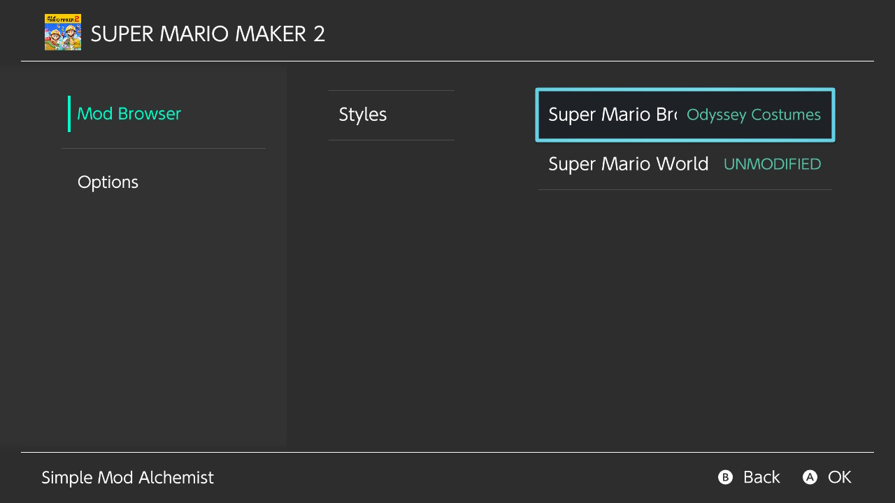
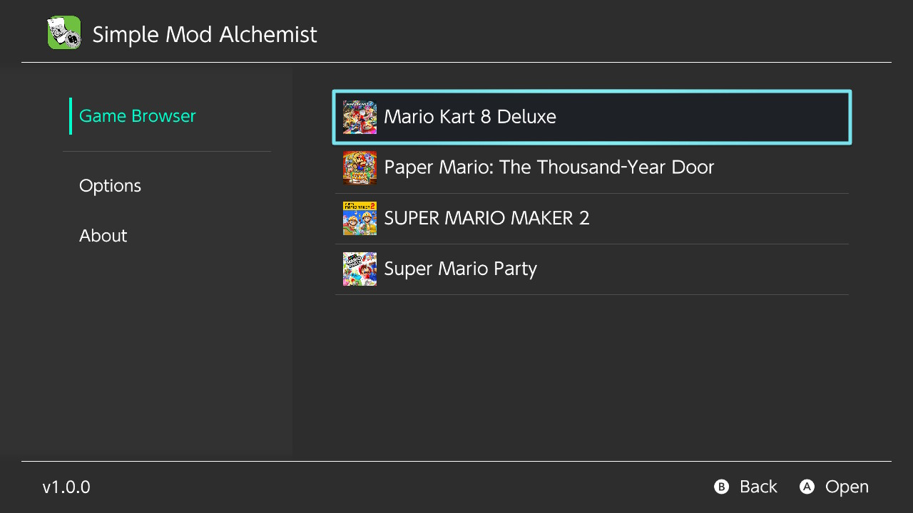
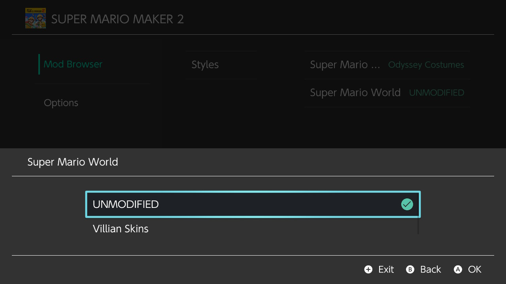

# Simple Mod Alchemist

Simple Mod Alchemist is the definitive Nintendo Switch mod management solution. It originated from merging the UI of the well-known [SimpleModManager](https://github.com/nadrino/SimpleModManager) app with the efficient backend functionality of the (now depricated) [State Alchemist](https://github.com/gtiersma/state-alchemist) overlay, introducing new improvements and increased stability through the process!

<p align="center"></p>


## Features

* Intuitive UI for changing mods
* Mods are categorized in groups and by what they replace
* Mod files are moved, not copied
  * This makes switching between large files seemingly instant
* Can automatically bring over mods from SimpleModManager to start using right away
* Scalable - works with lists of hundreds of mods
* More to come!


## Screenshots



<details>
  <summary><b>Spoiler: More Screenshots</b></summary>




</details>


# Quick Start (tl;dr)

1. Extract the contents of the latest release to the root of your SD card.

2. In the `mod_alchemy` folder that now exists on your SD root, create a folder with the name of the game's title ID.

3. Within that folder, create folders for each group you want to categorize your mods in. Example: `mod_alchemy/<title_id>/Characters/`

4. Within those folders, create folders for each thing in the game that you plan to replace with a mod. Example: `mod_alchemy/<title_id>/Characters/Mario/`

5. Within those folders, create folders for each mod you have. Example: `mod_alchemy/<title_id>/Characters/Mario/Spongebob/`

6. Within those folders, move each mod's folder structure into its corresponding folder. The folder structure should typically begin with the `romfs` folder (which should then contain the other folders and files that comprise the mod).

7. Have fun!

8. If this **Quick Start** guide doesn't make sense, read the detailed instructions below for a more thorough explanation.


# Installation

1. This assumes you already have a Nintendo Switch set up with Atmosphere CFW installed.

2. Download the latest release of Simple Mod Alchemist, extracting its contents to the root of your SD card.

3. There should now be a `mod_alchemy` folder in your SD card root.

4. In `mod_alchemy`, create a folder. Give that folder the name of a game's **title ID** you want to mod. You can find the title ID for the game at this website: [NSWDB](https://nswdb.com/)

5. In the folder you created in step 4, create a folder for each "group" you wish to categorize your mods in. Some typical examples of names you may want to use would be "Characters", "Levels", "Music", etc.

6. In each of those folders created in step 5, create a folder for each thing you want to mod in a game. For example, if you have a mod that would replace Mario in a game, you would want to create a folder named "Mario" in a folder like `mod_alchemy/<title_id>/Characters/`. Then create folders for the names of any other characters you have mods for in the `Characters` folder.

7. In each of those folders created in step 6, create a folder for each mod you have. For example, if you have a mod that replaces Mario with Spongebob, you would want to created a folder named "Spongebob" in a folder like `mod_alchemy/<title_id>/Characters/Mario/`. Then create folders for the names of any other mods you have that replace Mario in the `Mario` folder.

8. In each of those folders created in step 7, place the folders with the files for each mod in that folder. For example, if you have a mod that replaces Mario with Spongebob, you would want to place the folder structure for the "Spongebob" mod in a folder like `mod_alchemy/<title_id>/Characters/Mario/Spongebob/`. In most cases, a mod's file structure should start with a folder named `romfs`, so there should be a `mod_alchemy/<title_id>/Characters/Mario/Spongebob/romfs/` folder which would then contain the rest of the folders and files that make up the mod. The folder structure should match the game's filesystem.

9. Remove any files that are currently in the `/atmosphere/contents/<title_id>/` folder that may conflict with files from any mods that you set up in step 8. If you want to keep them, move them to a mod folder within `mod_alchemy` created in the manner described in steps 5-8. If you don't feel very sure of what you're doing, it's a good idea to create a backup of `/atmosphere/contents/<title_id>/`.

10. Create a backup of the `mod_alchemy/<title_id>/`. The app operates by moving files between `mod_alchemy/<title_id>/` and `/atmosphere/contents/<title_id>/`. If you ever disable all the mods through the app, it should bring all the mod files back to the folders under `mod_alchemy/<title_id>/`, but I make no guarantee that there won't be a problem that will prevent that, so I recommend backing up those folders and files **before you start using Simple Mod Alchemist** just to be safe.

11. You're ready to use Simple Mod Alchemist! You can access it the same as you would any other Switch homebrew application.

### Adding Mods

Mods can be added to the app at any time by following the same instructions listed above.

### Deleting Mods

If there ever is a mod you're using that you want to delete permanently, **make sure to disable that mod in Simple Mod Alchemist first** if it isn't already disabled. This will make sure all files for that mod are returned to their original locations within the folders in `mod_alchemy`.

Once you're sure it's disabled, deleting the mod is as easy as deleting the `mod_alchemy/<title_id>/<group_name>/<thing_being_modded>/<mod_name>` folder belonging to it from your SD card.

Disabling the mod is necessary because enabled mods have their files mixed in with all the other enabled mod files within the `/atmosphere/contents/<title_id>/` folder. Disabling the mod will move its files back to the original folder they were in: `mod_alchemy/<title_id>/<group_name>/<thing_being_modded>/<mod_name>`, that way, when you delete the folder, you can be sure all files for that mod are being deleted as well.


# Help / FAQs

### There's a game that isn't appearing in the game list

Only games that you created a folder for (named with the game's title ID) will appear in the game list.

Make sure you named the folder you created in step 4 in the **Installation Instructions** correctly. Make sure the folder's name really is the correct title ID for that game.

---

### After enabling a mod, I don't notice it in the game.

Disable the mod in the app. Then in a file explorer, go to that mod's folder in the `mod_alchemy/<title_id>/<group_name>/<thing_being_modded>/` folder to inspect its folders and files.

Make sure the folders and files are all named correctly. The folder directly in the `mod_alchemy/<title_id>/<group_name>/<thing_being_modded>/<mod_name>/` folder should usually be named `romfs`. `romfs` should contain more folders matching the game's file system.

---

### Mod is only being partially enabled. Not all files belonging to that mod were enabled.

Use a file explorer to go within `/atmosphere/contents/<title_id>/` and find the places the files should be located at (matching the locations of the files that weren't moved in `mod_alchemy/<title_id>/<group_name>/<thing_being_modded>/<mod_name>/`.

If there is already a file within `/atmosphere/contents/<title_id>/` with the same name and location as a file that's not being moved from within `mod_alchemy/<title_id>/<group_name>/<thing_being_modded>/<mod_name>/`, then that is the reason it's not enabling. There's already a file for another mod in its place. There's a conflict. If you really want the mod to be fully enabled, you will need to find out where that file came from. It may have come from another mod that was enabled by the app.

Try using **Disable All Mods** in the app. Then try searching your SD card for that file's name. You should be able to see all the mods that use it. If some of those mods may have been enabled at the same time, that would've been the problem. You will need to try to sort out the conflicting files between them.

If the file is still located within `/atmosphere/contents/<title_id>/` even after disabling all mods through the app, then that file does not belong to any of the mods in Simple Mod Alchemist. It was put there manually, so you will need to figure out why it's there and if you need it.

Once the conflicting files are sorted out so that the files can now be moved to their spots within `/atmosphere/contents/<title_id>/`, the mod should be enabling itself fully.

If there was no conflict to begin with, there is a bug that can be encountered infrequently that causes specific files to not be moved.

This bug seems to be outside Simple Mod Alchemist, so there may be nothing that can be done about it at the moment. It's infrequent, so it shouldn't happen often.

But even if this bug occurs, the rest of the files should still be moving properly when enabling or disabling the mod, so there should be no need to worry about lost files.

---

### The menu options are weird or messed up. Maybe I'm seeing an option named "romfs" in the menu.

The folder structure in the `mod_alchemy` folder is probably not set up correctly.

If you tried enabling any mods in the menu (or if you're not sure if you did), first use the **Disable All Mods** option in the mod options menu to fix any folders or files that may have been improperly moved from the `mod_alchemy` folder.

Review steps 5-9 in the installation instructions.

Make sure all the mods are set up in the following manner in the following folder structure: `mod_alchemy/<title_id>/<group_name>/<thing_being_modded>/<mod_name>/romfs/<mod folders and files here>`

---

### Everything froze for a long time when I tried to enable a mod.

This can happen if a mod consists of a really large number files (even if those files are tiny).

Wait for it to finish. Interrupting it could corrupt your mods or even your SD card, and then you would need to restore it from a backup. It may take up to 10 minutes if the mod consists of over 1,000 files.

Using such large mods (such as mod packs) is slow at the moment. It would be better to split the mod pack into smaller, individual mods that would be comprised of under ~100 files.

If the mod doesn't consist of that many files, you may want to double-check it because it can be an easy thing to miss. Go to the `/atmosphere/contents/<title_id>/` folder on your SD card if the mod is active (`mod_alchemy/<title_id>/<group_name>/<thing_being_modded>/<mod_name>/` if it's not active) and look through the folders and files the mod consists of. See if there are a large number of files that shouldn't be there. Follow the instructions in the **Deleting Mods** section to remove it.

---

### I was taken to an error screen while using the app

Please file a GitHub issue with the exact error you see. Also describe how you came across the error, the folders that contain the related mod (if it was related to a specific mod), and any other details you think may be helpful.

---

### When using the app, it closed abruptly, claiming it closed from an error

See if it continues to happen.

If it was working fine at one point, but suddenly this issue began happening, try restoring from a backup if you have one. To do so, use the **Disable All Mods** option for the game that's having issues. Then delete the game's folder from within the `mod_alchemy` folder, copying the backup into its place.

If it still continues to be a problem, please file a GitHub issue, describing how you came across the error, how the folders that contain the related mod are organized (if it was related to a specific mod), and any other details you think may be helpful.

### I want to remove the app and all mods it is using from my SD card

For each game in app's game list, choose the **Disable All Mods** option before you delete anything.

After doing so, delete the `mod_alchemy` folder from the root of your SD card, along with the Simple Mod Alchemist app file from the `switch` directory.

---

### I want to remove the app and all mods it is using from my SD card, but I can't access the Disable-All-Mods option in the app for some reason

You'll need to manually handle the mod files. Please see the **Advanced** section.

---

### Can files from other mods be left in the game's title ID folder under the Atmosphere folder?

Yes.

The app will only touch its own mod files (including those that it moved into the `/atmosphere/contents/<title_id>/` folder).

If there are any mod files you put directly within the `/atmosphere/contents/<title_id>/` folder, those mods will stay there and will not show up in the app.

---

### How does the app handle conflicts between files?

If it tries to enable a mod that uses the same files as a mod that already exists within the `/atmosphere/contents/<title_id>/` folder (whether those files are managed by Simple Mod Alchemist or not), those files won't be activated.

The app only moves non-conflicting files belonging to the mod being enabled. Whatever files are currently in `/atmosphere/contents/<title_id>/` will stay there.

For example, if you enable a mod with a file named `mario`, but there's already a file named `mario` in the same spot within the `/atmosphere/contents/<title_id>/` folder, the `mario` file for the mod you enabled won't be used. The other `mario` file that's already there will be used.

---

# Advanced: Managing the App's Mods Manually

By understanding how Simple Mod Alchemist interacts with files and folders on the SD card, you can change the app's mods from any file explorer and maybe a text editor. This also means it's also possible to create a script to automatically change/add/remove the app's mods as well.

If doing any manual changing between mods as described here, be careful and don't make mistakes. If anything isn't named perfectly, it could brake how Simple Mod Alchemist manages mods, even causing it to crash.

### Enabled Mods

To see which mod is currently enabled over something, navigate to `mod_alchemy/<title_id>/<group_name>/<thing_being_modded>/`.

In that directory, you may see a `.txt` file that shares a name with one of the mod folders. That is the active mod. The `.txt` contains the paths of each file belonging to that mod that was moved to `/atmosphere/contents/<title_id>/`. Keep in mind that not all the mod's files may have been moved if there was a conflicting file in `/atmosphere/contents/<title_id>/`, but the `.txt` records only those that *were* moved.

Within the mod's folder, you'll notice that the folders remain even though the files are gone.

If there is no `.txt` file, that means no mod is enabled.

**To manually disable a mod**:

1. Move each file listed in the `.txt` file from within the `/atmosphere/contents/<title_id>/` folder to the same corresponding folder within the `mod_alchemy/<title_id>/<group_name>/<thing_being_modded>/<mod_name>/` folder.

2. Once you are sure you moved all the files listed in the `.txt` file, delete the `.txt` file.

3. The next time you open Simple Mod Alchemist, it will show the mod as disabled, and the mod will be able to enable and re-disable itself properly.

Once there is no mod enabled in the `mod_alchemy/<title_id>/<group_name>/<thing_being_modded>/` folder, you can now manually enable a different mod if desired:

**To manually enable a mod**:

1. Create a `.txt` file directly in `mod_alchemy/<title_id>/<group_name>/<thing_being_modded>/`, naming it **the exact same** as the name of the folder of the mod you wish to enable.

2. Within that `.txt` file, include every file belonging to that mod (including the folder path beginning in `mod_alchemy/<title_id>/<group_name>/<thing_being_modded>/<mod_name>/` leading to each file). In most cases, the path will always begin with `romfs`. Each mod file with its folder path should be on a new line.

3. Move all folder(s) in `mod_alchemy/<title_id>/<group_name>/<thing_being_modded>/<mod_name>/` to `/atmosphere/contents/<title_id>/`.

4. The next time you open Simple Mod Alchemist, it will show the mod as enabled, and the mod will be able to disable and re-enable itself properly.


# Super Advanced: Build From Source

## Prerequisites (using Bash)

- DevKitPro: https://github.com/devkitPro/pacman/releases

```bash
sudo installer -pkg /path/to/devkitpro-pacman-installer.pkg -target /
```

- Define environment (add the following lines to your bashrc):

```bash
function setup_devkitpro()
{
    echo "Seting up DevKitPro..." >&2
    export DEVKITPRO=/opt/devkitpro
    export DEVKITA64=${DEVKITPRO}/devkitA64
    export DEVKITARM=${DEVKITPRO}/devkitARM
    export DEVKITPPC=${DEVKITPRO}/devkitPPC
    export PORTLIBS_PREFIX=${DEVKITPRO}/portlibs/switch

    export PATH=${DEVKITPRO}/tools/bin:$PATH
    export PATH=${DEVKITA64}/bin/:$PATH

    source $DEVKITPRO/switchvars.sh
    return;
}
export -f setup_devkitpro
```

- Source your bashrc and execute "setup_devkitpro"

- Install packages

```bash
sudo dkp-pacman -Sy \
  switch-bulletphysics switch-bzip2 switch-curl\
  switch-examples switch-ffmpeg switch-flac switch-freetype\
  switch-giflib switch-glad switch-glfw switch-glm\
  switch-jansson switch-libass switch-libconfig\
  switch-libdrm_nouveau switch-libexpat switch-libfribidi\
  switch-libgd switch-libjpeg-turbo switch-libjson-c\
  switch-liblzma switch-liblzo2 switch-libmad switch-libmikmod\
  switch-libmodplug switch-libogg switch-libopus\
  switch-libpcre2 switch-libpng switch-libsamplerate\
  switch-libsodium switch-libtheora switch-libtimidity\
  switch-libvorbis switch-libvorbisidec switch-libvpx\
  switch-libwebp switch-libxml2 switch-mbedtls switch-mesa\
  switch-miniupnpc switch-mpg123 switch-ode switch-oniguruma\
  switch-opusfile switch-pkg-config switch-sdl2 switch-sdl2_gfx\
  switch-sdl2_image switch-sdl2_mixer switch-sdl2_net\
  switch-sdl2_ttf switch-smpeg2 switch-zlib switch-zziplib\
  devkitA64 devkitpro-keyring general-tools pkg-config\
  libnx libfilesystem switch-tools devkitpro-pkgbuild-helpers\
  -r /System/Volumes/Data
sudo dkp-pacman -Suy -r /System/Volumes/Data
```

### Compile
```bash
git clone https://github.com/gtiersma/SimpleModAlchemist.git
cd SimpleModAlchemist
cmake -B build_switch -DPLATFORM_SWITCH=ON
make -C build_switch Simple_Mod_Alchemist.nro -j$(nproc)
```

# Special Thanks

* **SciresM** and the other contributors for creating and maintaining LayeredFs and Atmosphere

* **devkitPro** for creating libnx

* **Nadrino** for creating SimpleModManager

* **Natinusala**, **xfangfang** and any other contributors to Borealis

# Legal Disclaimers

This software is built with the sole intention of running unofficially on the Nintendo Switch console. The Nintendo Switch is a product consisting of both hardware and software developed by Nintendo Co. Ltd. This software has not been licensed by Nintendo in any form. Nintendo is not affiliated with the creation of this software in any form.

The Nintendo Switch logo is a trademark of Nintendo Co. Ltd.

This software is purely a non-profit endeavor. Any usages of copyrighted material comprised within this software have not been used in a manner to gain compensation in any manner.

All other portions of this software are licensed under the GPL 3.0 standard, giving the general public permission to use, modify, or distribute this software in accordance with the terms and conditions that can be viewed [here](https://github.com/gtiersma/SimpleModAlchemist?tab=GPL-3.0-1-ov-file#GPL-3.0-1-ov-file).

The author assumes no responsibility for any problems that may occur from modified derivative works from this software.

This software is not intended to be used in any manner that involves or encourages digital piracy. The author assumes no responsibility for any crimes users may perform through the use of this software.

The author provides no guarantee that the software will operate as intended or if it will operate at all. By using this software in any form or manner, you agree that the author will not be held responsible for any damage that may occur to the device(s) it may be used with, whether the damage be physical or digital.
